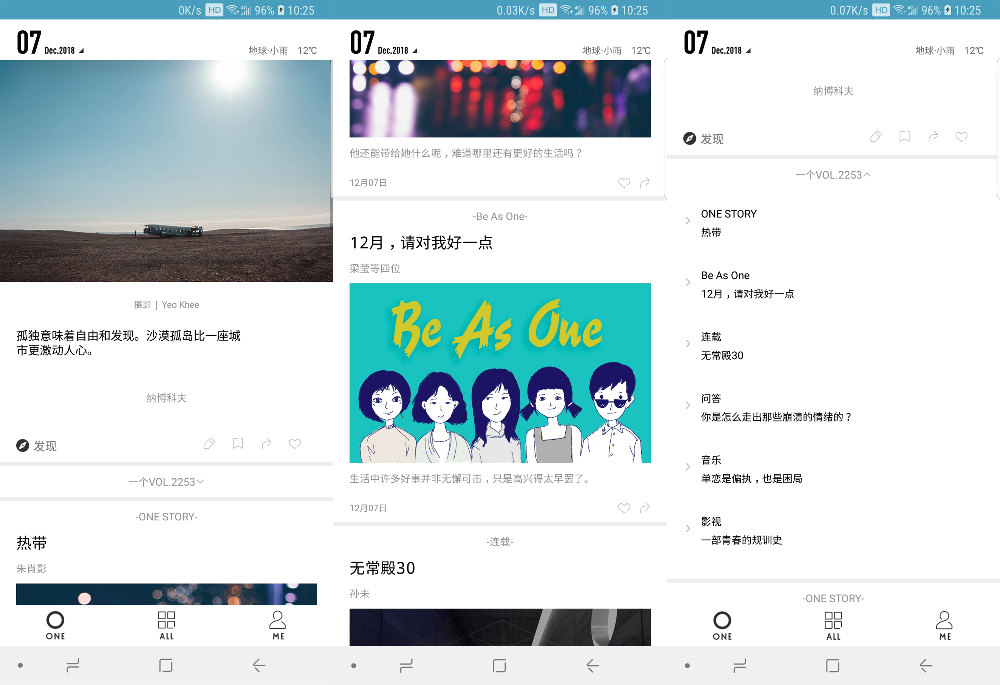
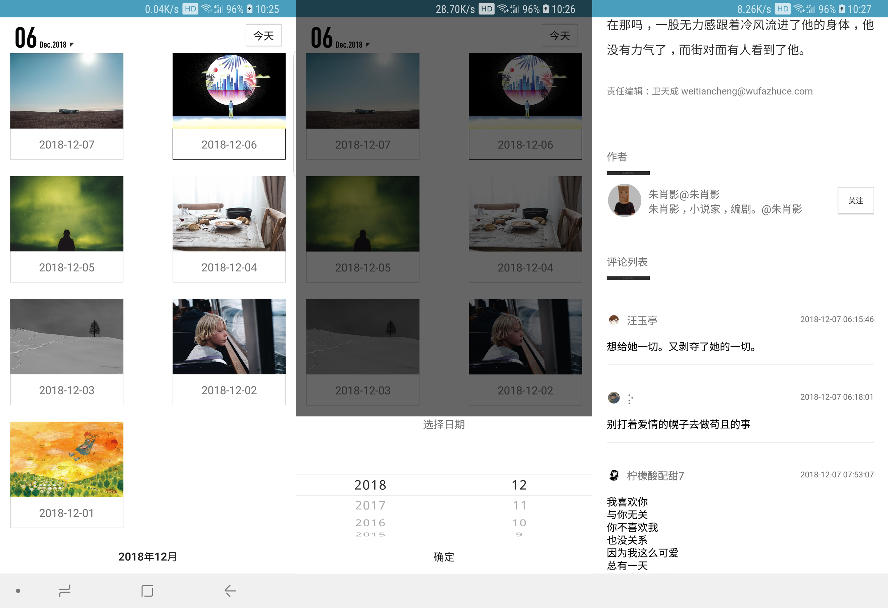
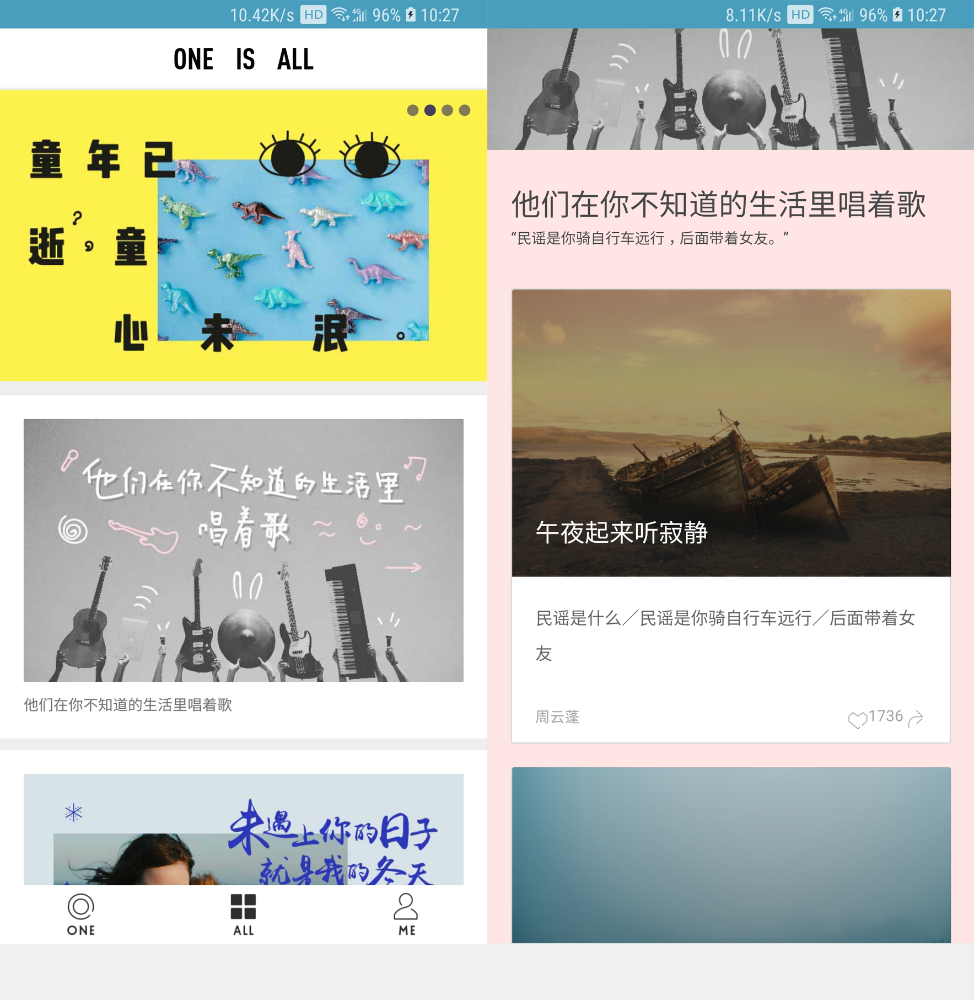

## one
# 仿「ONE · 一个」
# 施工中
## Statement
以下所有 API 均由 `ONE 一个` 提供, 本人采取非正常手段获取. 本程序仅供学习交流, 不可用于任何商业用途

## Screenshots

## Preview

## Points
- 首页用了ViewPager + Fragment 实现无限滑动和懒加载
- 解决Viewpager多页面跳转白屏问题
- 抓了ONE 一个的包
- MVP模式
- RxJava + Retrofit2 + OkHttp3 请求网络
- Okhttp3 网络缓存
- 自定义了日期选择器
- RxBus 代替 EventBus 进行组件通讯
- 使用DiffUtil 刷新数据
- 自定义 BottomNavigationBehavior 实现上滑隐藏下滑显示
- Dagger2 依赖注入

## Libraries
- [Android Support Libraries](https://developer.android.com/topic/libraries/support-library/index.html)
- [Gson](https://github.com/google/gson)
- [Glide](https://github.com/bumptech/glide)
- [jsoup](https://jsoup.org/)
- [Retrofit](https://github.com/square/retrofit)
- [Dagger2](https://github.com/google/dagger)
- [androidWheelView](https://github.com/weidongjian/androidWheelView)
- [butterknife](https://github.com/JakeWharton/butterknife)
- [TwinklingRefreshLayout](https://github.com/lcodecorex/TwinklingRefreshLayout)
- [RxJava](https://github.com/ReactiveX/RxJava)
- [OkHttp](https://github.com/square/okhttp)
- [MultiType](https://github.com/drakeet/MultiType)
- [UltraViewPager](https://github.com/alibaba/UltraViewPager)
- [JsBridge](https://github.com/lzyzsd/JsBridge)

## Todo
- 播放音乐
- Me页面包括设置、夜间模式等功能
- 点赞、转发

## Lisense

MIT License

Copyright (c) 2018 Gnuey 

Permission is hereby granted, free of charge, to any person obtaining a copy
of this software and associated documentation files (the "Software"), to deal
in the Software without restriction, including without limitation the rights
to use, copy, modify, merge, publish, distribute, sublicense, and/or sell
copies of the Software, and to permit persons to whom the Software is
furnished to do so, subject to the following conditions:

The above copyright notice and this permission notice shall be included in all
copies or substantial portions of the Software.

THE SOFTWARE IS PROVIDED "AS IS", WITHOUT WARRANTY OF ANY KIND, EXPRESS OR
IMPLIED, INCLUDING BUT NOT LIMITED TO THE WARRANTIES OF MERCHANTABILITY,
FITNESS FOR A PARTICULAR PURPOSE AND NONINFRINGEMENT. IN NO EVENT SHALL THE
AUTHORS OR COPYRIGHT HOLDERS BE LIABLE FOR ANY CLAIM, DAMAGES OR OTHER
LIABILITY, WHETHER IN AN ACTION OF CONTRACT, TORT OR OTHERWISE, ARISING FROM,
OUT OF OR IN CONNECTION WITH THE SOFTWARE OR THE USE OR OTHER DEALINGS IN THE
SOFTWARE.
